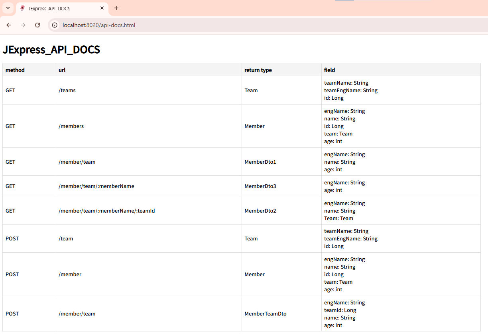

# JExpress

- Java의 경량 서버 JExpress

## 사용예제

```java

    // IServer app = new JExpress();
    // threadPool을 이용한 서버 생성방법
    IServer app = new JExpress(15);

    app.use(API_DOCS);
    app.use(CORS);
//        app.use(CORS, "https://bitlibrary.com");
    app.use(REQUEST_LOGGER);
    app.use(RESPONSE_TIME);
    app.use(DB_H2);
//        app.use(DB_MYSQL);

    //curl -i -X GET "localhost:8020/members"
    app.get("/members", (req, res) -> {
      JExpressCRUDRepository jcr = new JExpressCRUDRepository();
      List<Member> List = jcr.findAll(Member.class);
      
    // team에 소속된 member 등록
    app.post("/member", (req, res)-> {

      Map<String, String> body = req.getBodyMap();

      JExpressCRUDRepository jcr = JExpressCRUDRepository.getInstance();
      Member registerMember = jcr.registerEntityOrNull(body, Member.class);

      res.send(registerMember);

    }, Member.class);
    
    app.run(8020);
```
## 코딩 표준

- [JExpress 코딩 표준](docs/CodingStandard.md)

## 주요 기능

### CORS
- `app.use(CORS)`
  - 기본 설정: `Access-Control-Allow-Origin: *`
- `app.use(CORS, "https://bitlibrary.kro.kr")`
  - 커스텀 설정: `Access-Control-Allow-Origin: https://bitlibrary.kro.kr`

### Response Time
- `app.use(RESPONSE_TIME)`
  - 각 요청의 응답 시간을 출력

### ThreadPool
- 기본 스레드 풀(1개)  
  `IServer app = new JExpress()`
- 사용자 정의 스레드 풀  
  `IServer app = new JExpress(30)` (예: 30개의 스레드)

### DB 설정 (`persistence.xml` 설정 사용)
- H2 사용  
  `app.use(DB_H2)`
- MySQL 사용
  `app.use(DB_MYSQL)`

### API 문서 자동 생성
- `app.use(API_DOCS)`
- 생성 위치 : `http://localhost:port/api-docs.html`

  

## 실행 환경

- Java 17
- Gradle
- DB(persistence.xml로 설정 관리)
  - MySQL (설정 시 사용)
  - 설정하지 않을 경우 H2 In-Memory 모드로 자동 동작

## 개발 우선 순위
1. 기능 추가
   - 테스트는 curl과 postman을 통해서 진행하며, 기능이 중요한 경우 TDD로 개발 진행
2. 테스트 추가
3. 리팩토링

## 브랜치 전략
- `main` : 안정적인 주요 기능이 통합되는 브랜치로, 실행 가능한 코드를 유지한다.(H2를 이용해 Docker 없이 바로 실행 가능)
- `feat/*` : 새로운 기능 개발 시 사용하는 브랜치로, 실패 가능성이 있는 실험적인 작업에 사용한다.
- `test/h2`: h2,Docker로 JExpress를 실행해 볼 수 있는 브랜치
- `test/mysql`: mysql,docker-compose로 JExpress를 실행해 볼 수 있는 브랜치

## 사용 방법
- MySQL 미사용시
  - `git checkout test/h2`
  - `docker build --no-cache -t jexpress .`
  - `docker run --env-file .env -d --rm -p 8123:8123 jexpress`
- MySQL 사용시
  - `git checkout test/mysql` 
  - `docker-compose up`
